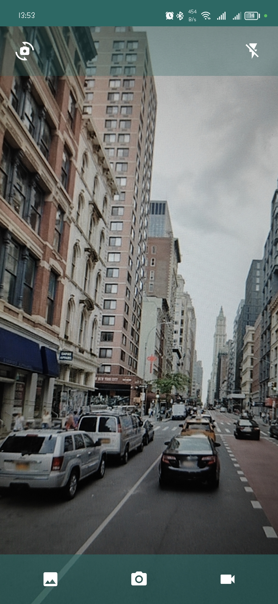

# Camera X
Camera X is a native Android mobile application that uses Kotlin Programming Language to take pictures and record videos.

## Application Features:
* Take pictures.
* Record videos.
* Save them on the device.
* Open image picker to pick any image or video from your gallery.

## Tools used
* Kotlin.
* Jetpack Compose.
* CameraX.
* Image Picker.
* Exo Player.

## Downloads
[APK Download](https://drive.google.com/file/d/13TlyuduMfm462ePHS6FZ4J6mkAaTjE5Q/view?usp=sharing)

## Screenshots

  

